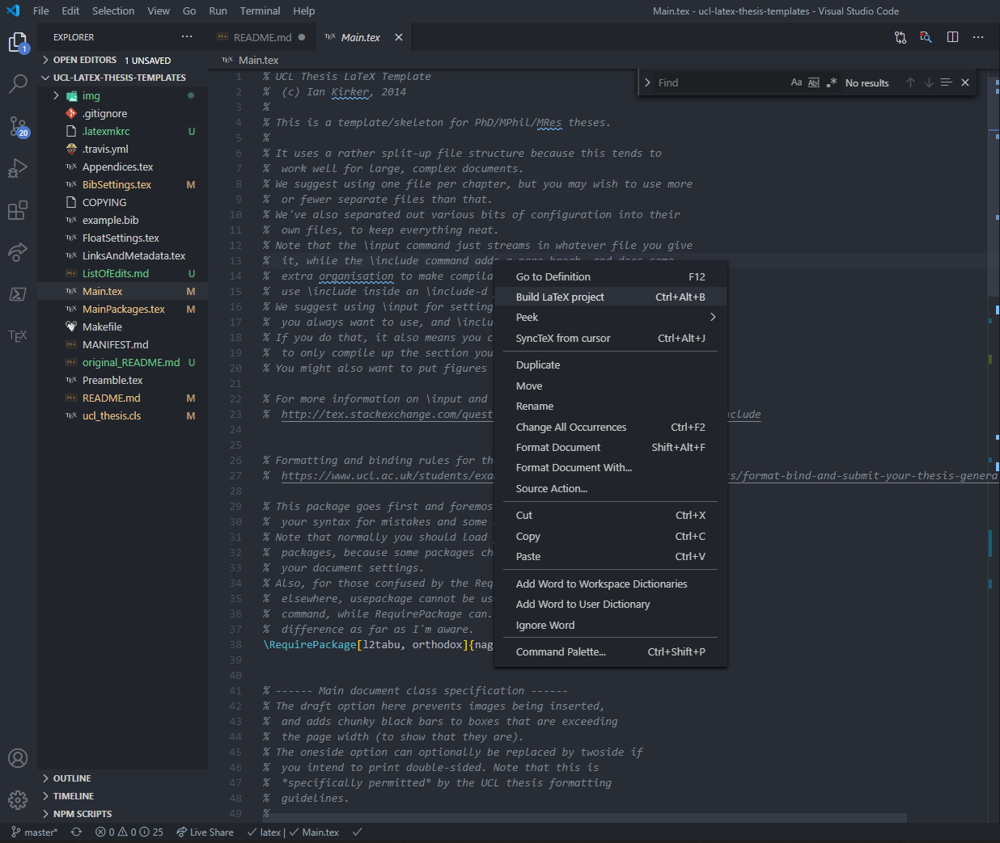
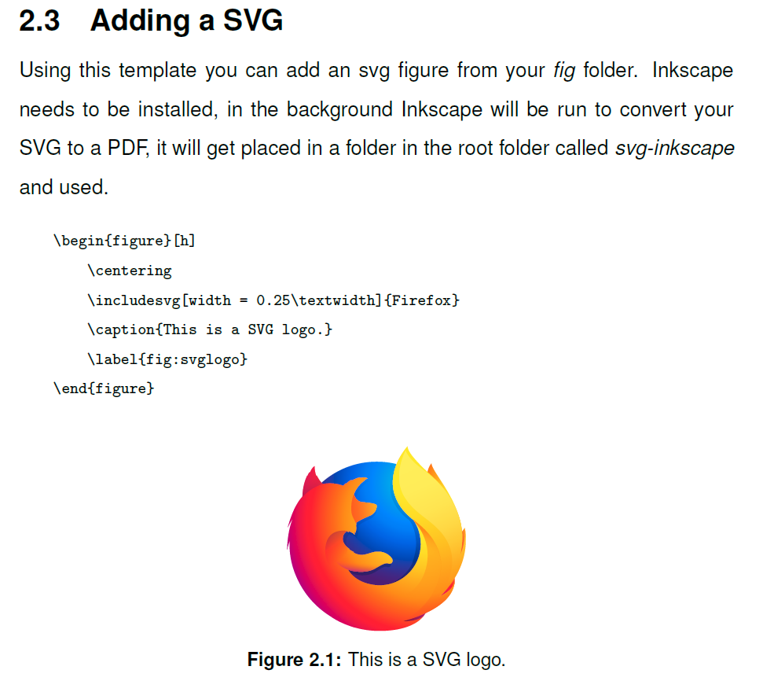

- [Requirements](#requirements)
  - [VSCode](#vscode)
  - [LaTeX distribution](#latex-distribution)
  - [PERL](#perl)
  - [Inkscape](#inkscape)
  - [Python](#python)
  - [VSCode Extension](#vscode-extension)
- [Setting up LaTex Workshop](#setting-up-latex-workshop)
- [Project Setup](#project-setup)
  - [Baked changes](#baked-changes)
  - [Set default path for figures](#set-default-path-for-figures)
  - [Bibliography Style](#bibliography-style)
  - [Bibliography file](#bibliography-file)
  - [Metadata](#metadata)
  - [Preamble](#preamble)
- [Start Writing](#start-writing)
  - [Jumping from PDF to .tex and back](#jumping-from-pdf-to-tex-and-back)
  - [Adding chapters](#adding-chapters)
  - [Adding content](#adding-content)
  - [Creating sections](#creating-sections)
  - [Different content types](#different-content-types)
    - [Citation](#citation)
    - [Labels](#labels)
    - [Adding SVG](#adding-svg)
    - [Adding Images](#adding-images)
    - [Creating Tables](#creating-tables)
    - [Adding Source Code](#adding-source-code)
    - [Creating Pseudo-code](#creating-pseudo-code)
    - [Text commands](#text-commands)
- [Troubleshoot](#troubleshoot)
  - [Formatting issues](#formatting-issues)
- [Useful links](#useful-links)

This is a UCL Thesis LaTeX template.

Original repo is [here](https://github.com/UCL/ucl-latex-thesis-templates).
This repo is a fork from a recent [pull-request](https://github.com/UCL/ucl-latex-thesis-templates/pull/25), the PR adds UCL banner in the first page, switches to Helvetica based on recent [guidelines](https://www.ucl.ac.uk/students/exams-and-assessments/research-assessments/format-bind-and-submit-your-thesis-general-guidance#:~:text=Your%20thesis%20must%20be%20presented,of%20no%20less%20than%2012.&text=Illustrations%20should%20be%20permanently%20mounted,use%20sellotape%20or%20similar%20materials.) and adds an Impact Statement area if it is required for your thesis, refer to the guidelines.

This fork, changes some extra things and the readme here will guide you through how to start writing your thesis in VSCode.

For a list of edits to the forked repo please refer to the [List of Edits](ListOfEdits.md).

# Requirements

## VSCode

Install [VSCode](https://code.visualstudio.com/).

Make sure you select those options during the installation.


## LaTeX distribution

Install [MikTex](https://miktex.org/download). "MikTex is a free distribution of the TeX/LaTeX typesetting system for Windows".

After installation, check for upgrades, `Start` > `MikTeX Console` > `Updates` > Click `Check for Updates` button, once its done click `Update Now`.


Make sure that a package we will use is installed, the package is called `Latexmk`. Got to `Packages` > search for `latexmk` > click the filter icon > right-click on the result and `Install Package` if its already not installed.


## PERL

The extension we will use in VSCode uses a Perl Script called [Latexmk](https://mg.readthedocs.io/latexmk.html) the one we just made sure its installed, for things to work, you need to have Perl already installed on your system. You can check the link for installation on other systems, but for windows, you will need to install [StrawberryPerl](http://strawberryperl.com/), go with the 64-bit option if your system supports it.

## Inkscape

It is recommended that any diagrams you want to include are vector graphics, one of the most common formats is SVG. The template already has a package to support that, but this package requires that you have [Inkscape](https://inkscape.org/) installed.

After installing Inkscape, add this to your Environment Path `C:\Program Files\Inkscape\bin` most probably that is where it will be installed. To do that `Start` > write `environment variables` and press enter > Click the `Environment Variables` button at the bottom > Select `Path` and `Edit` > `New` and paste Inkscape's installation location.


Try running `inkscape -V` in any console, just to see if you can access it. A restart is required, or else it will not work.

## Python

For syntax highlighting your source code, we use a package called [Minted](https://github.com/gpoore/minted), for details about how to use it in LaTeX check this [link](https://www.overleaf.com/learn/latex/Code_Highlighting_with_minted).

For this to work, the package uses a Python package called [pygments](https://pygments.org/). The fastest way to install this, if you don't have Python on your system is to download [Miniconda](https://docs.conda.io/en/latest/miniconda.html) which is a stripped down version of Anaconda, a conda/python distribution.

I went with the `Python 3.8 - Windows - 64-bit` version.


After installation, got to `Start` > write `Anaconda`, you will see something called `Anaconda Prompt` > once you open it write `pip install pygments` > when its done write `conda list` you will see a url at the top


Go to that location, look for a folder called `scripts` inside, make sure there is a file called `pygmentize.exe` inside. If that is the case, and it should, add this location i.e `C:\Users\<your-profile-name>\anaconda3\Scripts` to your Environment Path as well, similar to before with Inkscape.

Almost there...

## VSCode Extension

So the extension we will use, the one we are setting all this up for, is called `LaTeX Workshop`, open VSCode and in the extensions tab, search for the package and install it.


If all went well, you can now go to the folder where this repo is, right-click and `Open with Code`. You should see a new side-bar icon called `TEX`.


Congrats you don't need to install anything else!

# Setting up LaTex Workshop

- There is an option to build the document using right-click, I like to enable that. Go to VSCode settings, `Ctrl + ,`, and search for `Latex-workshop: show context menu` and enable it.

Now if you open `Main.tex` and right-click, you should see `build LaTeX project`.



If all goes well, and you don't receive any errors, you should be able to select the `View LaTeX PDF File` icon at the top.


If you do receive any errors, create an issue here and i will try to help.

- In `Latex Workshop` there is a nice shortcut for surrounding a selected text with a Latex command. The shortcut for this is `Ctrl+L, Ctrl+W`, I like to change that to `Ctrl+Alt+S`. In VSCode, got to `File` > `Preferences` > `Keyborad shortcuts` and search for `latex-workshop.surround` select the pencil icon next to it to edit the shortcut, press `Ctrl+Alt+S` then Enter to save it. Now if you select any text and press that you will get a list of all latex commands.
- Most of the packages we use require a flag called `-shell-escape` in order to work. So we have a `.latexmkrc` file with those options. If this folder is not in the root, `Minted` `SVG` and other functionalities will not work. The file is already included in the repo, but will add the content here just for reference. The last line sets our main entry point for compiling the document as `Main.tex`, this allows us to run `build LaTeX project` from any other `.tex` file in the project, otherwise you would only be able to do it from `Main.tex`.

  ```
  $latex = 'latex -shell-escape %O %S';
  $pdflatex = 'pdflatex -shell-escape %O %S';

  # specify the main file
  @default_files = ('Main.tex');
  ```

# Project Setup

So now that everything in your environment is in place, lets see what we can do in terms of project specific settings.

## Baked changes

To see a list of things I changed and possibly how you can change them to something else check [ListOfEdits](ListOfEdits.md).

It includes:

- Changing the packages used.
- Adding a subtitle to the main page.
- Changing the name of the course (Architectural Computation).
- Changing the bibliography style.
- Setting the default path for graphics and svg files.
- Setting the source of the bibliography.

## Set default path for figures

You can do that in your `Main.tex` file. In line `63` you will see its set to be `fig/`, this allows you to directly reference figures from inside that folder using their name in your source.

```latex
\graphicspath{{fig/}}
\svgpath{{fig/}}
```

## Bibliography Style

You can change that in your `BibSettings.tex` file. I set it to Harvard style. You can check all styles [here](https://www.bibtex.com/styles/).

```latex
\bibliographystyle{agsm}
```

## Bibliography file

I use [Mendeley](https://www.mendeley.com/?interaction_required=true) which allows me to export all bibliography for a project in a single `.bib` file. I included in the repo a sample in `Thesis.bib` file. The project is setup to read references from there, this is indicated in the `Main.tex` file, line `114`.

```latex
\bibliography{./Thesis}
```

## Metadata

Set the meta data that will be included in your compiled PDF in the `LinksAndMetadata.tex` file. you can/should edit the highlighted entries below from that file.

```diff
\AtBeginDocument{
    \hypersetup{
+        pdfsubject={Thesis Subject},
+        pdfkeywords={Thesis Keywords},
+        pdfauthor={Author},
+        pdftitle={Title},
    }
}
```

## Preamble

In the `Preamble.tex` file, we set a lot of things about your thesis.

In line `6` you can set the title of your degree

```diff
\makeatletter
+\renewcommand {\@degree@string} {Master of Science}
\makeatother
```

In line `10`, the name

```diff
\makeatletter
+\renewcommand {\@course@title} {Architectural Computation}
\makeatother
```

In line `20`, you can choose to add a banner or not (true/false) and if you will use it where is the banner located. You can visit this [link](https://imagestore.ucl.ac.uk/imagestore/start/ucl-banners/For%20PRINT?authrequest=1&https=1) to download official UCL banners. The original file is of size `5.0 cmx1.0 cm at 300 dpi`. Below you can see the output when set to false and true respectively.

```diff
+\setbool{useuclbanner}{true}
+\uclbannerlocation{fig/ucl-banner-a4-port-orange-u.eps}
```


In line `23` set those trivial details ;)

```diff
\title{My Great Title}
\subtit{A new way of doing things}
\author{Sherif Tarabishy}
\department{The Bartlett School of Architecture}
```

In line `36` write your abstract.

```diff
\begin{abstract} % 300 word limit
+....
\end{abstract}
```

If you don't need to include an impact statement you can comment out everything starting from

```
\begin{impactstatement}
...
\end{impactstatement}
```

you do that by selecting the lines and pressing `Ctrl + K` followed by `Ctrl + C`.

Add your acknowledgments between

```diff
\begin{acknowledgements}
+ Acknowledge all the things!
\end{acknowledgements}
```

In line `81` set how many levels of subsections should the table of Content include, setting this to `0` you will only get chapters. Setting to `2` means you would get `Chapter.section.subsection`

```
\setcounter{tocdepth}{2}
```

# Start Writing

## Jumping from PDF to .tex and back

The document you just built is on it's own a tutorial, you can compare the source and the PDF to see how you can accomplish specific things.

Something to help you with that is a package called `SyncTex` that `LaTeX Workshop` uses by default. What this allows you to do is, `Ctrl + left-click` on any element in the PDF and you will be taken to the part in the `.tex` files that generated it.

You can also go the other way around, while having a `.tex` file open, click somewhere and choose `synctex from cursor`.


## Adding chapters

The original repo, had each chapter as a separate `.tex` file, which you then "inlude" in your `Main.tex` file.

```
\include{Introduction}
\include{Chapter2}
\include{Chapter3}
\include{Conclusions}
\include{Appendices}
```

What I prefer to do is just include one file in the `Main.tex` file, I called that `Chapters.tex`. So in the `Main.tex` file, our document structure would look like this

```
\begin{document}
\include{Preamble}
\include{Chapters}
\bibliography{./Thesis}
\end{document}
```

`Chapter.tex` file will be the file where we add in a high-level sense the chapter names, and where they should get their content from.

```
\chapter{Introductory Material}
\label{introChapter}
\input{Introduction}
%%%%%%
\chapter{Examples and Demos}
\label{examplesChapter}
\input{Examples}
%%%%%%
\input{Appendices}
```

## Adding content

in the previous file when we used `\input{Introduction}` this means that we have a file called `Introduction.tex` in the root that contains our content. If the chapter was the first chapter to be created (first to appear in the source) then all sections and subsections in that `Introduction.tex` file will be appended to `1.`. If we later decide content from this file should be added to a different chapter, everything inside will get renumbered accordingly.

## Creating sections

After building the document, open `Introduction.tex` and compare it to the compiled PDF to see how you can start writing and creating sections and subsections. Notice all chapters,sections and subsections gets added to the ToC automatically with hyperlinks to their location.

`\blindtext` use in the file is a command to generate random placeholder content (Lorem Ipsum).

## Different content types

For all the next sections, please refer to `Examples.tex` and its compiled PDF to continue this walk-through.

### Citation


### Labels


### Adding SVG



### Adding Images


### Creating Tables

### Adding Source Code

### Creating Pseudo-code

### Text commands

# Troubleshoot

Some problems you might face.

## Formatting issues

You should be able to right-click in a `.tex` file and choose to `format document`, if you get an error when you do that, it might be related to the package used to format the text. The package is called `latexindent`, start by opening `MikTeX Console` and check if the package is installed.

Open `CMD` or `Powershell` and type `latexindent` you should be able to start the command.


If you get an error, it might be that a dependency for this package is not installed, this could be

```
stderr: Can't locate Log/Log4perl.pm in @INC (you may need to install the Log::Log4perl module) .....
```

in that case, following the steps [here](https://tex.stackexchange.com/a/445536) go to `Start > CPAN Client > install Log::Log4perl`.

You might also get the same error but for `Log::Dispatch::File` in that case run `install Log::Dispatch::File` instead.

# Useful links

If anyone finds useful resources that think they should be added here please send me or create a PR.

- [Exporting Matplotlib plots to LaTeX](https://timodenk.com/blog/exporting-matplotlib-plots-to-latex/).
- [Common mistakes in technical writing](https://cs.dartmouth.edu/~wjarosz/writing.html).
- A good place to check for examples is `Overleaf`, for example you can [search for pseudo-code](https://www.overleaf.com/latex/examples?addsearch=pseudocode) and check the examples.
